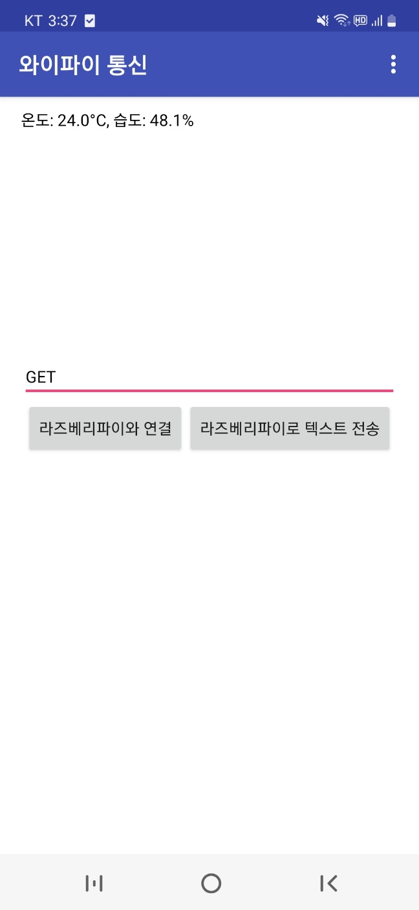
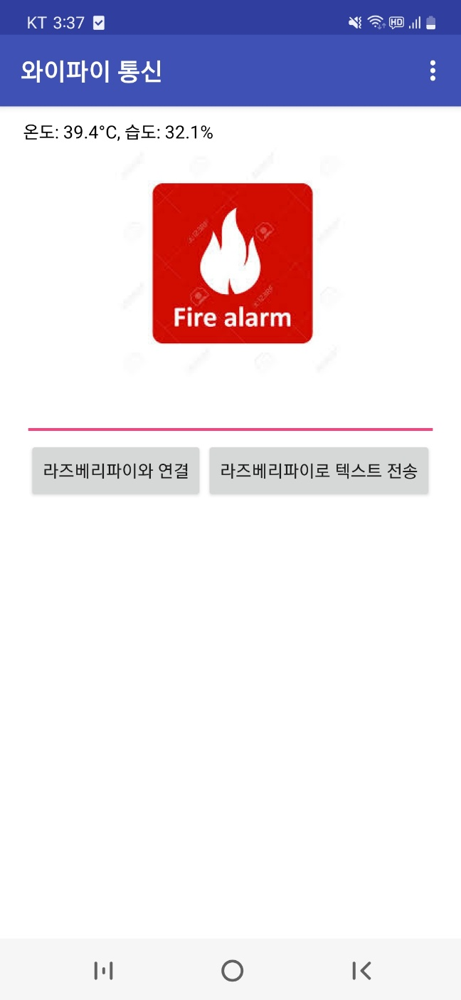
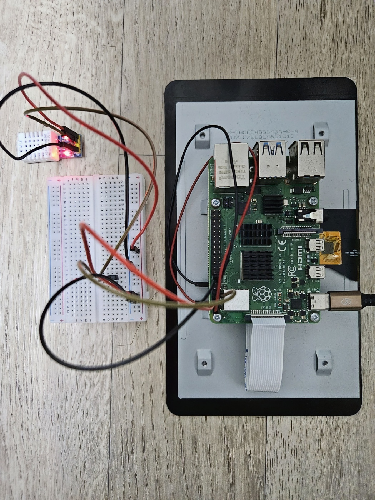

# 온 습도 모니터링 시스템

### **비정상 환경 감지를 위한 온 습도 모니터링 시스템**
본 시스템은 고온(35℃ 이상) 또는 고습(60% 이상) 환경에서 발생할 수 있는 위험 요소를 사전에 감지하기 위해 개발된 **실시간 온습도 모니터링 시스템**입니다.  

DHT22 센서와 Raspberry Pi를 기반으로 동작하며, Wi-Fi TCP 통신을 통해 원격지에서도 실시간으로 데이터를 확인할 수 있습니다.  

---

##  시스템 구성
- **센서 및 장치**
  - DHT22 센서 : 온도·습도 측정
  - Raspberry Pi : 데이터 수집 및 서버 역할

- **통신 구조**
  - Raspberry Pi → **TCP 서버**
  - 모니터링 단말(PC/스마트폰 등) → **TCP 클라이언트**
  - Wi-Fi를 통한 무선 연결 지원

---

##  주요 기능
- 실시간 온도/습도 측정
- 온도 35℃ 이상, 습도 60% 이상일 경우 **비정상 환경 감지**
- 위험 상황 발생 시 **클라이언트에 경고 메시지 전송**
- 원격지에서도 실시간 데이터 확인 가능

---

##  특징
-  **실시간 환경 모니터링**  
-  **무선 네트워크 기반 원격 감시**  
-  **임계치 초과 시 자동 알림**  

### 📸 프로젝트 사진
<!--GET요청 -->

  
**GET요청**  
스마트폰 어플로 "GET" 요청을 통해 온습도 확인

---

<!-- 경고메세지 -->

**경고메세지**  
온도 혹은 습도의 임계치 초과시 경고메세지 발생

---

<!-- 회로구조 -->

**회로구조**  
라즈베리파이의 회로구조
